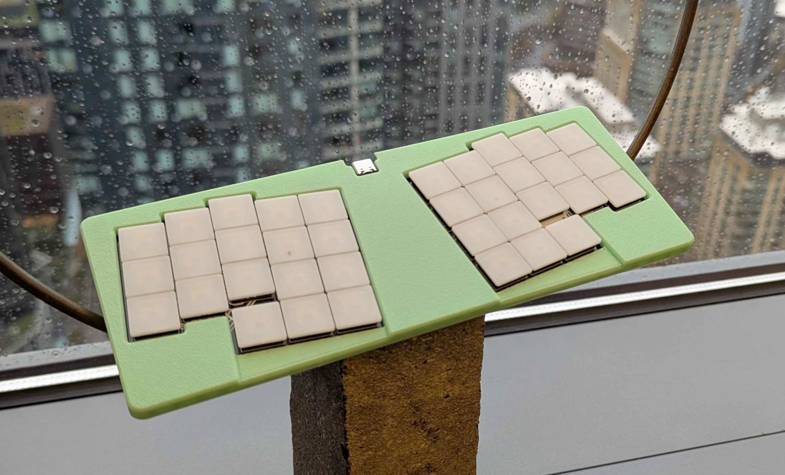

## Le Oeuf

An ultra-low profile (Kailh PG1425 "X Switch") keyboard inspired by Le Chiffre.

## Build guide (wired)

### BOM

- 36x 1N4148 diodes, SOD-123
- 36x Kailh PG1425 + caps
- 1x 74HC595D shift register, SOP-16
- 1x Seeed Studio XIAO RP2040

### Assembly

1. Solder all surface-mount components on the front of the board (diodes, shift register, XIAO)
2. Solder switches
3. Flash firmware, install caps, and enjoy :D

## Build guide (wireless)

Coming soon :D

## Accessories

- **["Oeuf Poché"](cases/oeuf-poche)** - A 3d-printable minimal case. Mounts with four self-tapping M2x4mm screws.
- **["SK-1425"](cases/SK-1425)** - A two-part case by [seirin-blu](https://github.com/seirin-blu).

## Firmware

ZMK firmware available from [eggsworks/zmk-config](https://github.com/eggsworks/zmk-config/)

## Production files

Gerbers, BOM, and centroid files have been added under [le-oeuf/production/](le-oeuf/production/). These Gerbers are optimized for production by PCBWay and may not necessarily be accepted by other manufacturers. The BOM and centroid file include only the diodes and the shift register, leaving the switches and MCU to be hand-soldered.

## License

This design is available under the terms of the [CERN-OHL-S](LICENSE).

## Acknowledgements

- MCU footprint derived from [ebastler/marbastlib](https://github.com/ebastler/marbastlib/)
- Switch footprint derived from [kicad-footprint-kailh-pg1425-x-switch](https://github.com/shikamiya/kicad-footprint-kailh-pg1425-x-switch)
- Layout derived from ergogen source supplied for [sporkus/le_capybara_keyboard](https://github.com/sporkus/le_capybara_keyboard)
- PCB art kindly provided by transthropology

